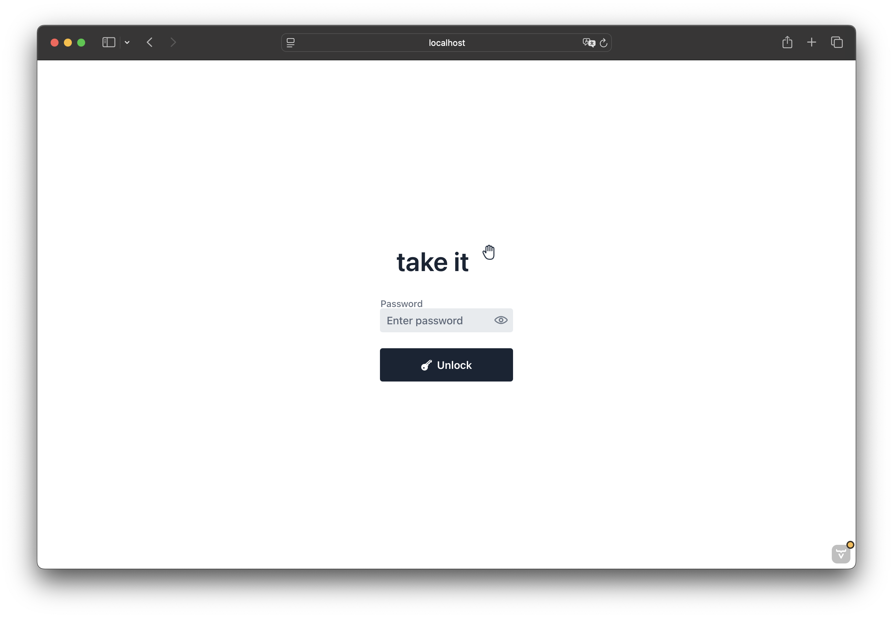

# takeit

# Start Generation Here

A dropin (https://github.com/wjakew/dropin) sister that allows user to download files from selected location on host. Simple file sharing. A dumber FTP without uploading function :D

# Functionality
- Allows users to download files from specified locations on the host.
- Simple and user-friendly interface.
- No upload functionality, focusing solely on file retrieval.

# Deployment Instructions

1. Download latest Release from release page
2. Run java with command 'java -jar takeit.jar --server.port=<your server port>'
3. Fill needed information in the created .properties file
4. Re-run the application
5. App is avaiable on selected port on your machine.

